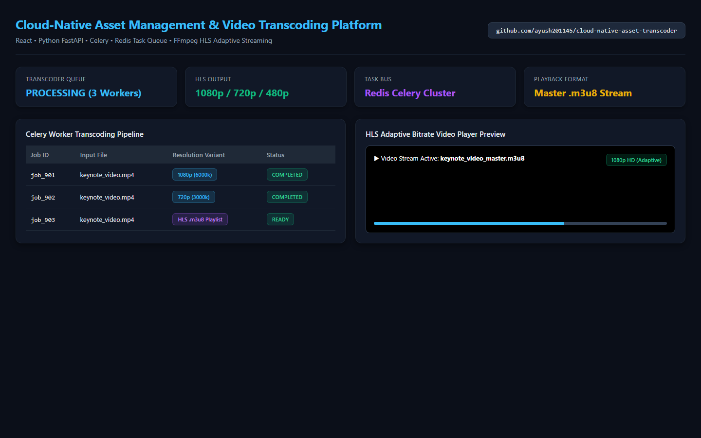

# Cloud-Native Asset Management & Video Transcoding Platform




Media asset portal where user uploads trigger background worker tasks (Celery/Redis) to transcode high-resolution MP4/MOV videos into adaptive HLS (HTTP Live Streaming) playlists using FFmpeg pipelines.

## Features
- **Asynchronous Task Queue**: Celery worker integration backed by Redis for offloading heavy CPU encoding.
- **FFmpeg HLS Transcoding**: Multi-bitrate HLS output generation (720p @ 2000k, 480p @ 1000k) with master `.m3u8` playlist generation.
- **RESTful Video API**: Job status polling, video file upload, and stream delivery endpoints.
- **Dockerized Environment**: Bundled Linux environment pre-configured with FFmpeg CLI binaries.

## Getting Started

### Local Setup
```bash
pip install -r requirements.txt
uvicorn app:app --reload --port 8000
```

### Start Background Celery Worker
```bash
celery -A tasks.worker worker --loglevel=info
```

### Upload Video via API
```bash
curl -X POST "http://localhost:8000/api/upload" \
     -F "file=@sample_video.mp4"
```

## Tech Stack
- **API Engine**: Python, FastAPI, Uvicorn
- **Background Worker**: Celery, Redis Task Broker
- **Media Pipeline**: FFmpeg (HLS, x264 codec)
- **Containerization**: Docker